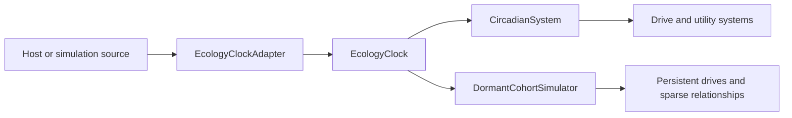

# Ecology Clock and Dormancy Audit

## Scope

This audit covers the Ecology Clock, circadian activity profiles, persistent
FATIGUE, purposeful REST, and bounded dormant-cohort catch-up foundations. It
does not claim full daily routines, broad species tuning, population lifecycle,
or exact offscreen world simulation.

## Audit Answers

1. **Authoritative time boundary:** `EcologyClockAdapter` is the only module that knows how REAL_TIME, SIMULATION, and FIXED sources are read.
2. **Stable downstream contract:** every source becomes day index, circular phase, local clock fields, monotonic ecology time, and source timestamp.
3. **Gen1Recomp host-now source:** sandboxed `os.time()` is available to mods.
4. **Gen1Recomp local-time source:** sandboxed `os.date("*t", timestamp)` is available to mods.
5. **Public/private status:** these functions are in the public safe sandbox globals; no private engine module is required.
6. **Engine evidence:** `src/mods/Sandbox.lua` defines `SAFE_OS` with `time`, `date`, `clock`, and `difftime`.
7. **Test evidence:** `tests/modkit/cases/sandbox.lua` asserts that `os.time` remains available and notes that the clock was not the sandbox hole.
8. **Timezone handling:** local timezone and DST conversion are delegated to the host C runtime used by LuaJIT's `os.date` implementation.
9. **`mod.datetime`:** it formats supplied timestamps according to display preferences; it is not a current-time source.
10. **Private Gen 2 clock:** `src/core/gen2/Clock.lua` is not imported because this standalone Gen 1 mod does not own that private module.
11. **Engine changes:** none are required or permitted by this implementation.
12. **REAL_TIME semantics:** each sample re-reads host epoch and local parts; Wild Ecology does not persist a synthetic running wall clock.
13. **SIMULATION semantics:** ecological position advances only from the Wild Ecology-owned source tick.
14. **Simulation day options:** 30 minutes, 1 hour, 6 hours, and 24 hours are supported; the default is 1 hour.
15. **Closed-game simulation policy:** simulation mode explicitly freezes while the game is closed.
16. **Real-time closed-game policy:** real-time mode observes host elapsed time on return and performs coarse catch-up.
17. **FIXED semantics:** fixed phase is a deterministic transient override for tests/debugging and does not update per-source observed timestamps.
18. **Source switching:** incomparable source timestamps are rebased with zero dormant elapsed rather than mixed.
19. **Backward host movement:** elapsed is clamped to zero and marked `BACKWARD`; persistent ecology is never reversed.
20. **Large forward movement:** elapsed remains available and is marked `FORWARD` above the configured five-minute threshold.
21. **Live forward jumps:** active materialized actors use the same coarse simulator as dormant catch-up; missed live ticks are not replayed.
22. **Semantic bands:** DAWN, DAY, DUSK, and NIGHT are derived from phase for diagnostics and presentation, not binary behavior commands.
23. **Clock diagnostics:** source changes, band changes, and discontinuities create compact lifecycle records only when those transitions occur.
24. **Clock persistence:** schema v4 stores mode, simulation position, source tick provenance, and observations by source.
25. **Circadian profiles:** DIURNAL, NOCTURNAL, CREPUSCULAR, FLEXIBLE, and WEAK_CIRCADIAN are data profiles rather than behavior controllers.
26. **Transitions:** circular distance plus smoothstep produces soft peak edges with no midnight discontinuity.
27. **Multiple peaks:** profile data supports multiple weighted peaks, used by the crepuscular profile.
28. **Individual variation:** stable personality-derived phase offset is limited to plus or minus 0.04 day.
29. **Amplitude variation:** stable personality-derived scale is limited to 0.92 through 1.08.
30. **Persistent versus derived:** profile ID, phase offset, and amplitude scale persist; current activity/rest biases are recomputed.
31. **Species seam:** species ecology data chooses a profile without embedding species-specific logic in the controller.
32. **Proof species only:** PIDGEY and SPEAROW are diurnal, RATTATA is nocturnal, and untuned species fall back to flexible.
33. **Utility ownership:** circadian output is a bias consumed by utility; it never directly chooses or executes a behavior.
34. **Emergency priority:** existing FLEE preemption remains authoritative regardless of rest bias or fatigue.
35. **FATIGUE ownership:** FATIGUE is a normalized persistent generic drive, initialized and migrated through the same drive framework as THIRST.
36. **Fatigue gain:** movement and purposeful activity accumulate fatigue; FLEE is more costly and ordinary stationary behavior is much slower.
37. **Fatigue recovery:** REST applies a negative accumulation rate and is the purposeful recovery path.
38. **REST versus SETTLED:** REST has a distinct intent/state handler and completion rule; SETTLED is calm inactivity, not recovery by definition.
39. **REST utility:** fatigue supplies homeostatic pressure, circadian rest bias boosts moderate fatigue, and strong fatigue can dominate active time.
40. **REST completion:** recovery ends at the FATIGUE release threshold or on a strong active-phase return while fatigue is below activation.
41. **REST motion:** REST clears movement requests and remains stationary.
42. **Runtime interruption:** threats can interrupt REST through the existing intent and FLEE ownership paths.
43. **Cohort membership:** only actors actually materialized when a map unloads enter its dormant cohort.
44. **Unselected population:** route population members that were not live are not silently granted social or drive simulation in that cohort.
45. **Cohort snapshot:** map, member IDs, ecology timestamp, actor-scoped drive opportunity evidence, last cell, region, group, coarse state, and close contacts persist.
46. **Forbidden state:** NPC objects, routes, pathfinding results, movement claims, perception caches, current targets, and motion commands do not persist.
47. **Capture ordering:** the cohort is captured before avatars are destroyed and transient runtime state is reset.
48. **Return ordering:** dormant catch-up completes before avatar selection and materialization resumes.
49. **Catch-up frequency:** a dormant snapshot is caught up once and marked live, preventing duplicate catch-up on repeated initialization.
50. **Duration complexity:** circadian integration uses at most 48 samples, whether elapsed time is one day, 30 days, or 180 days.
51. **Drive integration:** THIRST, HUNGER, and FATIGUE update analytically from elapsed hours and average circadian bias; no minute or missed-tick loop exists.
52. **Opportunity conservatism:** dormant drinking or feeding is allowed only when a compatible opportunity was proven per actor with live WorldSemantics and ordinary WALK planning.
53. **Navigation ownership:** unload evidence reuses `WorldSemantics`, `SpatialGoal`, and `NavigationPlanner`; there is no offscreen navigator and catch-up never plans.
54. **Drive provenance:** dormant updates advance `lastUpdatedTick` when a simulation tick exists so live drive updates do not double-count elapsed time.
55. **Social candidates:** only close unload contacts, shared groups, and existing directed relationship edges are considered.
56. **Spatial capture:** close contacts are found through neighboring position buckets, not an all-pairs scan.
57. **Sparse directionality:** candidate and mutation keys remain observer to subject; reverse edges are neither implied nor allocated automatically.
58. **Social mutation:** only bounded familiarity and affinity can grow from estimated benign exposure, using exponential saturation.
59. **No fabricated conflict:** dormant simulation creates no attacks, hostility, threat memories, perceptions, contact events, or battle outcomes.
60. **Diagnostics:** catch-up start/completion summaries, per-drive and per-social diagnostic events, actor inspection, and cohort inspection exist.
61. **Persistence safety:** schema v4 migrates old entities, initializes clock and cohort storage, and strips every entity's `runtimeState` on save.
62. **Claim boundary:** this remains a clock/circadian/fatigue/rest/dormancy foundation. Active long-horizon composition is proven separately; this does not make dormant catch-up an exact offscreen ecosystem.

## Measured Performance

`tests/dormant_performance_spec.lua` constructs spatially separated actors with
one existing directed ring edge per actor. This makes eligible work exactly
$N$ candidates while reporting the full $N(N-1)$ directed-pair denominator.
Measurements use `lua55.exe` and `os.clock()` on the development machine; the
timer resolution is approximately 1 ms.

| Actors | Elapsed | Runtime | Segments | Candidates / possible |
|---:|---:|---:|---:|---:|
| 10 | 1 hour | 1 ms | 2 | 10 / 90 |
| 10 | 1 day | 1 ms | 48 | 10 / 90 |
| 10 | 30 days | 1 ms | 48 | 10 / 90 |
| 10 | 180 days | 1 ms | 48 | 10 / 90 |
| 20 | 1 hour | 2 ms | 2 | 20 / 380 |
| 20 | 1 day | 2 ms | 48 | 20 / 380 |
| 20 | 30 days | 2 ms | 48 | 20 / 380 |
| 20 | 180 days | 1 ms | 48 | 20 / 380 |
| 50 | 1 hour | 4 ms | 2 | 50 / 2450 |
| 50 | 1 day | 3 ms | 48 | 50 / 2450 |
| 50 | 30 days | 4 ms | 48 | 50 / 2450 |
| 50 | 180 days | 3 ms | 48 | 50 / 2450 |

The meaningful result is bounded work, not sub-millisecond precision: after one
day, duration no longer increases segment count, and ring candidate count stays
linear while the all-pairs denominator grows quadratically.

## Verification

Focused specifications cover source normalization, simulation duration, fixed
time, backward/forward discontinuities, smooth profile transitions, profile
variation, REST utility and completion, FLEE interruption, water/no-water
catch-up, active-cycle overlap, no-contact sparsity, 180-day bounds, lifecycle
ordering, schema migration, runtime stripping, inspector output, and the full
performance matrix.

## Deferred Work

- Richer food/rest ecology and live tuning of the now-proven composed active rhythm.
- Broad Gen I species profile data and tuning.
- Rest-site preference and navigation.
- Population replenishment, migration, evolution, and unmaterialized-population models.
- Calendar/season/weather ecology and exact historical event reconstruction.
- Larger-device profiling; the included measurements are deterministic development-machine evidence, not a cross-platform performance guarantee.
